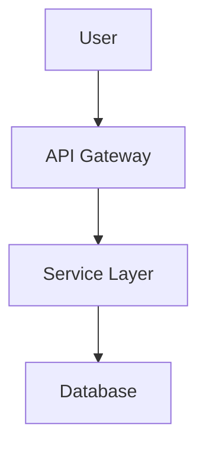
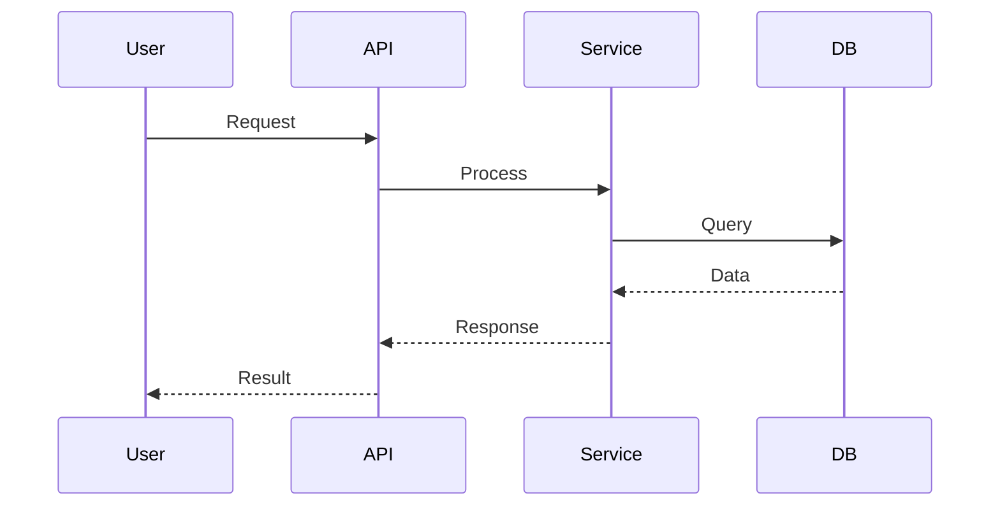

# MermaidVisualizer

Automated extraction and generation of Mermaid diagrams from markdown files.

## Overview

MermaidVisualizer is a Python tool that recursively scans directories for markdown files, extracts Mermaid diagram definitions, and automatically generates visual diagrams as image files (PNG/SVG). Perfect for documentation projects, technical wikis, and automated diagram generation pipelines.

**Zero external dependencies required!** Uses the [mermaid.ink](https://mermaid.ink) API by default - no Node.js, Chrome, or Puppeteer needed.

## Features

- **Zero Dependencies**: Uses mermaid.ink API by default - just install and run
- **Automatic Extraction**: Finds all \`\`\`mermaid code blocks in markdown files
- **Recursive Scanning**: Processes entire directory trees
- **Multiple Formats**: Generate PNG or SVG diagrams
- **Organized Output**: Creates structured output directory with clear naming
- **Diagram Mapping**: Generates index showing all diagrams with source links
- **Rich CLI**: Beautiful command-line interface with progress indicators
- **Optional Local Rendering**: Use mermaid-cli for offline/bulk processing

## Installation

### Standard Install (Recommended)

```bash
# Install with pip
pip install mermaid-visualizer

# Or with UV
uv tool install mermaid-visualizer
```

**That's it!** No Node.js, no Chrome, no Puppeteer. Just run:

```bash
mermaid generate -i ./docs
mermaid generate -i ./docs/architecture.md -f svg
```

### Local Rendering (Optional)

For offline use or very large diagrams, you can optionally install mermaid-cli for local rendering:

#### Prerequisites
- Python 3.10+
- Node.js (for Mermaid CLI via npx)
- Chrome headless shell (for Puppeteer)

```bash
# Install mermaid-cli
npm install -g @mermaid-js/mermaid-cli

# Install Chrome headless shell for Puppeteer
npx puppeteer browsers install chrome-headless-shell
```

Then use the `--local` flag to render locally:

```bash
mermaid generate --local -i ./docs
mermaid generate --local -s 3 -w 2400  # High-resolution output
```

### Development Install

```bash
# Clone the repository
git clone <repository-url>
cd MermaidVisualizer

# Create virtual environment
uv venv

# Activate virtual environment
source .venv/bin/activate  # On Windows: .venv\Scripts\activate

# Install with all dependencies
uv pip install -e ".[full,dev]"
```

## Usage

### Basic Commands

```bash
# Generate diagrams (uses mermaid.ink API by default)
mermaid generate

# Specify input and output directories
mermaid generate -i ./docs -o ./diagrams

# Generate SVG instead of PNG
mermaid generate -f svg

# Use local mermaid-cli instead of API
mermaid generate --local

# High-resolution output (local rendering only)
mermaid generate --local -s 3 -w 2400

# Scan without generating (dry run)
mermaid scan -i ./docs

# Clean generated diagrams
mermaid clean -o ./diagrams
```

If running from source:

```bash
python -m src.cli generate -i ./docs
```

### Configuration

Create a `config.yaml` file in the project root:

```yaml
input_dir: ./docs
output_dir: ./diagrams
format: png
recursive: true
theme: default
```

## Supported Diagram Types

MermaidVisualizer supports all Mermaid diagram types:

- Flowcharts
- Sequence Diagrams
- Class Diagrams
- State Diagrams
- Entity Relationship Diagrams
- Gantt Charts
- Pie Charts
- User Journey Diagrams
- Git Graphs

## Output Structure

```
diagrams/
├── index.html                          # Visual index of all diagrams
├── document1_0_flowchart.png
├── document1_1_sequence.png
├── document2_0_gantt.png
└── ...
```

## Example

Given a markdown file `docs/architecture.md`:

````markdown
# System Architecture

## Component Flow



## Sequence Diagram


````

Running `mermaid generate --input-dir docs` will create:

- `diagrams/architecture_0_flowchart.png`
- `diagrams/architecture_1_sequence.png`
- `diagrams/index.html`

## Development

### Running Tests

```bash
# Run all tests
pytest

# Run with coverage
pytest --cov=src --cov-report=html

# Run specific test file
pytest tests/test_extractor.py
```

### Code Formatting

```bash
# Format with Black
black src/ tests/

# Type checking with mypy
mypy src/
```

## Project Structure

```
MermaidVisualizer/
├── src/
│   ├── __init__.py
│   ├── cli.py            # CLI interface
│   ├── extractor.py      # Mermaid block extraction
│   ├── generator.py      # Diagram generation router
│   ├── api_renderer.py   # API rendering (mermaid.ink - default)
│   ├── file_handler.py   # File system operations
│   └── gist_handler.py   # GitHub Gist support
├── tests/
│   ├── __init__.py
│   ├── test_extractor.py
│   ├── test_generator.py
│   └── sample_data/
├── diagrams/             # Generated output (gitignored)
├── config.yaml           # Configuration
└── pyproject.toml        # Package configuration
```

## License

MIT License - see LICENSE file for details

## Contributing

Contributions welcome! Please feel free to submit a Pull Request.

## Troubleshooting

### API Rendering Issues (Default Mode)

If diagrams fail to generate using the default API mode:

- Check that your Mermaid syntax is valid on [Mermaid Live Editor](https://mermaid.live)
- Ensure you have internet connectivity
- Very large diagrams may exceed URL length limits - try `--local` mode
- Rate limiting may occur with many requests - add delays or use `--local`

### Local Rendering Issues (--local mode)

These issues only apply when using `mermaid generate --local`:

#### Chrome/Puppeteer Errors

If you see errors about "Could not find Chrome" or Puppeteer:

```bash
# Install Chrome headless shell
npx puppeteer browsers install chrome-headless-shell

# Verify installation
ls ~/.cache/puppeteer/
```

#### Mermaid CLI Not Found

If you see errors about `mmdc` or Mermaid CLI:

```bash
# Install globally (optional - npx is used by default)
npm install -g @mermaid-js/mermaid-cli

# Or use npx (automatically used by this tool)
npx @mermaid-js/mermaid-cli --version
```

## Roadmap

- [x] API mode for cloud rendering (mermaid.ink) - now the default!
- [x] Zero-dependency install (no Node.js/Chrome required)
- [ ] Batch processing optimization
- [ ] Custom theme support
- [ ] Docker container for isolated execution
- [ ] Plugin system for custom processors
- [ ] Cloud storage integration (S3, GCS)
