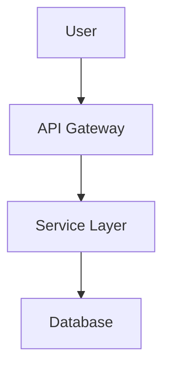
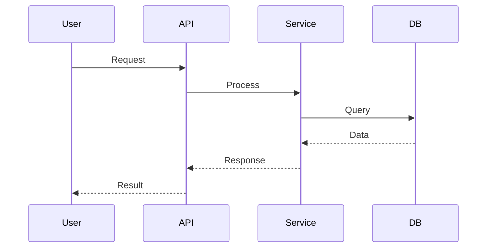

# MermaidVisualizer

Automated extraction and generation of Mermaid diagrams from markdown files.

## Overview

MermaidVisualizer is a Python tool that recursively scans directories for markdown files, extracts Mermaid diagram definitions, and automatically generates visual diagrams as image files (PNG/SVG). Perfect for documentation projects, technical wikis, and automated diagram generation pipelines.

## Features

- **Automatic Extraction**: Finds all \`\`\`mermaid code blocks in markdown files
- **Recursive Scanning**: Processes entire directory trees
- **Multiple Formats**: Generate PNG or SVG diagrams
- **Organized Output**: Creates structured output directory with clear naming
- **Diagram Mapping**: Generates index showing all diagrams with source links
- **Smart Caching**: Skips regeneration of unchanged diagrams
- **Rich CLI**: Beautiful command-line interface with progress indicators
- **Watch Mode**: Auto-regenerate diagrams when markdown files change

## Installation

### Prerequisites

- Python 3.10+
- Node.js (for Mermaid CLI via npx)
- UV package manager (recommended)
- Chrome headless shell (for Puppeteer/Mermaid rendering)

### Install as System-Wide Command

```bash
# Clone the repository
git clone <repository-url>
cd MermaidVisualizer

# Install Chrome headless shell for diagram rendering
npx puppeteer browsers install chrome-headless-shell

# Install globally with UV (recommended)
uv tool install --editable .
```

Now you can use the `mermaid` command from anywhere:

```bash
mermaid generate --input-dir ./docs
mermaid scan
mermaid clean
```

### Install for Development

```bash
# Create virtual environment
uv venv

# Activate virtual environment
source .venv/bin/activate  # On Windows: .venv\Scripts\activate

# Install dependencies
uv pip install -r requirements.txt
```

## Usage

### Basic Commands

If installed with `uv tool install`:

```bash
# Generate diagrams from markdown files in current directory
mermaid generate

# Specify input and output directories
mermaid generate --input-dir ./docs --output-dir ./diagrams

# Generate SVG instead of PNG
mermaid generate --format svg

# High-resolution output
mermaid generate --scale 3 --width 2400

# Scan without generating (dry run)
mermaid scan --input-dir ./docs

# Clean generated diagrams
mermaid clean --output-dir ./diagrams
```

If running from source:

```bash
python -m src.cli generate --input-dir ./docs
```

### Configuration

Create a `config.yaml` file in the project root:

```yaml
input_dir: ./docs
output_dir: ./diagrams
format: png
recursive: true
theme: default
```

## Supported Diagram Types

MermaidVisualizer supports all Mermaid diagram types:

- Flowcharts
- Sequence Diagrams
- Class Diagrams
- State Diagrams
- Entity Relationship Diagrams
- Gantt Charts
- Pie Charts
- User Journey Diagrams
- Git Graphs

## Output Structure

```
diagrams/
├── index.html                          # Visual index of all diagrams
├── document1_0_flowchart.png
├── document1_1_sequence.png
├── document2_0_gantt.png
└── ...
```

## Example

Given a markdown file `docs/architecture.md`:

````markdown
# System Architecture

## Component Flow



## Sequence Diagram


````

Running `mermaid generate --input-dir docs` will create:

- `diagrams/architecture_0_flowchart.png`
- `diagrams/architecture_1_sequence.png`
- `diagrams/index.html`

## Development

### Running Tests

```bash
# Run all tests
pytest

# Run with coverage
pytest --cov=src --cov-report=html

# Run specific test file
pytest tests/test_extractor.py
```

### Code Formatting

```bash
# Format with Black
black src/ tests/

# Type checking with mypy
mypy src/
```

## Project Structure

```
MermaidVisualizer/
├── src/
│   ├── __init__.py
│   ├── extractor.py      # Mermaid block extraction
│   ├── generator.py      # Diagram generation
│   ├── file_handler.py   # File system operations
│   └── cli.py            # CLI interface
├── tests/
│   ├── __init__.py
│   ├── test_extractor.py
│   ├── test_generator.py
│   └── sample_data/
├── diagrams/             # Generated output (gitignored)
├── config.yaml           # Configuration
└── requirements.txt
```

## License

MIT License - see LICENSE file for details

## Contributing

Contributions welcome! Please feel free to submit a Pull Request.

## Troubleshooting

### Chrome/Puppeteer Errors

If you see errors about "Could not find Chrome" or Puppeteer:

```bash
# Install Chrome headless shell (required for diagram rendering)
npx puppeteer browsers install chrome-headless-shell

# Verify installation
ls ~/.cache/puppeteer/
```

The tool will automatically detect and use the installed Chrome binary.

### Mermaid CLI Not Found

If you see errors about `mmdc` or Mermaid CLI:

```bash
# Install globally (optional - npx is used by default)
npm install -g @mermaid-js/mermaid-cli

# Or use npx (automatically used by this tool)
npx @mermaid-js/mermaid-cli --version
```

### Diagram Generation Fails

- Check that your Mermaid syntax is valid
- Try the diagram on [Mermaid Live Editor](https://mermaid.live)
- Ensure Chrome headless shell is installed (see above)
- Check logs for specific error messages
- Ensure Node.js is installed

## Roadmap

- [ ] Batch processing optimization
- [ ] Custom theme support
- [ ] Docker container for isolated execution
- [ ] API mode for programmatic access
- [ ] Plugin system for custom processors
- [ ] Cloud storage integration (S3, GCS)
