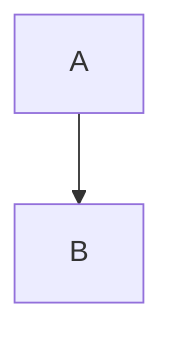
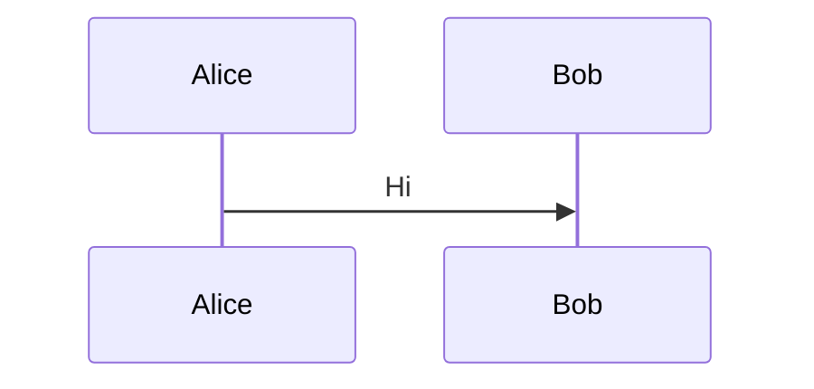

# Testing Suite Refactoring Metaprompt

## Context

The MermaidVisualizer project has a complete, working implementation in `src/` with integration tests passing. However, the detailed unit tests in `test_extractor.py`, `test_generator.py`, and `test_file_handler.py` need refactoring because they were written in parallel with implementation and have signature mismatches.

## Current Situation

### What Works ✅
- **Integration tests** (`test_integration.py`): 7/7 tests passing
- **Core implementation**: All modules working correctly
- **CLI**: Fully functional with scan/generate/clean commands

### What Needs Fixing ⚠️
- **test_extractor.py**: 27 tests, all failing due to signature mismatches
- **test_generator.py**: 30 tests, need to be updated for actual implementation
- **test_file_handler.py**: 34 tests, need signature updates

## Implementation Details

### extractor.py Actual Signatures

```python
from dataclasses import dataclass
from pathlib import Path
from typing import List

@dataclass
class MermaidDiagram:
    content: str
    source_file: Path
    start_line: int
    end_line: int
    diagram_type: str
    index: int

def extract_mermaid_blocks(file_path: Path) -> List[MermaidDiagram]:
    """Extract diagrams from a markdown FILE (not string)."""
    # Returns list of MermaidDiagram objects

def extract_from_multiple_files(file_paths: List[Path]) -> List[MermaidDiagram]:
    """Extract from multiple files."""
```

**Key differences from tests:**
- ❌ Does NOT accept string content directly
- ❌ Returns `List[MermaidDiagram]` not `List[Dict]`
- ❌ No optional parameters like `track_index`
- ✅ Always takes `Path` objects
- ✅ Always returns dataclass instances

### generator.py Actual Signatures

```python
from pathlib import Path
from typing import Tuple

def validate_mermaid_syntax(mermaid_content: str) -> Tuple[bool, str]:
    """Validate Mermaid syntax."""
    # Returns (is_valid, error_message)

def generate_diagram(
    mermaid_content: str,
    output_path: Path,
    format: str = "png"
) -> bool:
    """Generate diagram using mermaid-cli."""
    # Returns True on success, False on failure
    # Uses npx @mermaid-js/mermaid-cli via subprocess
```

**Key differences from tests:**
- ❌ No `use_npx`, `theme`, `background_color`, `width`, `height`, `scale`, `timeout`, `config_file` parameters
- ❌ No `batch_generate_diagrams()` function
- ❌ No `is_mermaid_cli_available()` function
- ✅ Simple signature: content, path, format
- ✅ Returns boolean success indicator

### file_handler.py Actual Signatures

```python
from dataclasses import dataclass
from pathlib import Path
from typing import List

@dataclass
class DiagramMapping:
    source_file: str
    diagram_files: List[str]
    timestamp: str

def find_markdown_files(directory: Path, recursive: bool = True) -> List[Path]:
    """Discover markdown files."""

def create_output_filename(
    source_file: Path,
    index: int,
    diagram_type: str,
    format: str
) -> str:
    """Generate output filename."""

def ensure_output_dir(output_dir: Path) -> None:
    """Create output directory."""

def save_mapping(mappings: List[DiagramMapping], output_dir: Path) -> None:
    """Save mappings to JSON."""

def load_mapping(output_dir: Path) -> List[DiagramMapping]:
    """Load mappings from JSON."""

def generate_index_html(mappings: List[DiagramMapping], output_dir: Path) -> None:
    """Generate HTML index."""
```

**Key differences from tests:**
- ❌ No `pattern`, `exclude_patterns`, `prefix`, `preserve_path` parameters
- ❌ No `generate_output_filename()` - it's `create_output_filename()`
- ❌ No `create_diagram_mapping()` function
- ✅ Simple, focused function signatures
- ✅ Returns `DiagramMapping` dataclass instances

## Refactoring Instructions

### Step 1: Understand Current Implementation

Before refactoring tests, read these files to understand actual behavior:
- `src/extractor.py` - especially the public functions and dataclasses
- `src/generator.py` - focus on what parameters are actually accepted
- `src/file_handler.py` - note the actual function names and signatures

### Step 2: Update test_extractor.py

**Changes needed:**

1. **All tests must use temp files, not strings**
   ```python
   # OLD (wrong)
   blocks = extract_mermaid_blocks(string_content)

   # NEW (correct)
   temp_file = tmp_path / "test.md"
   temp_file.write_text(string_content)
   blocks = extract_mermaid_blocks(temp_file)
   ```

2. **Access results via dataclass attributes**
   ```python
   # OLD (wrong)
   assert blocks[0]["diagram_type"] == "flowchart"

   # NEW (correct)
   assert blocks[0].diagram_type == "flowchart"
   assert blocks[0].content == "..."
   assert blocks[0].start_line == 5
   ```

3. **Remove unsupported parameters**
   - Remove `track_index=True` - indexing is always tracked
   - Remove any other optional parameters not in actual signature

4. **Update fixtures**
   - Keep content fixtures as strings
   - Create file fixtures that write strings to temp files

### Step 3: Update test_generator.py

**Changes needed:**

1. **Simplify function calls**
   ```python
   # OLD (wrong)
   result = generate_diagram(
       content, output, format="png",
       theme="dark", width=1920, use_npx=True
   )

   # NEW (correct)
   result = generate_diagram(content, output, format="png")
   ```

2. **Remove tests for non-existent functions**
   - Delete `test_batch_generate*` tests
   - Delete `test_is_mermaid_cli_available*` tests
   - Delete tests for unsupported parameters

3. **Focus on core functionality**
   - Test PNG generation
   - Test SVG generation
   - Test error handling
   - Test validation function
   - Mock subprocess.run properly

4. **Update mocking**
   ```python
   @pytest.fixture
   def mock_subprocess_success():
       with patch("src.generator.subprocess.run") as mock_run:
           mock_run.return_value = Mock(returncode=0, stdout="", stderr="")
           # Create fake output file
           yield mock_run
   ```

### Step 4: Update test_file_handler.py

**Changes needed:**

1. **Fix function names**
   ```python
   # OLD (wrong)
   filename = generate_output_filename(...)
   mapping = create_diagram_mapping(...)

   # NEW (correct)
   filename = create_output_filename(...)
   # create_diagram_mapping doesn't exist - create DiagramMapping directly
   mapping = DiagramMapping(source_file="...", diagram_files=[...], timestamp="...")
   ```

2. **Remove unsupported parameters**
   ```python
   # OLD (wrong)
   files = find_markdown_files(dir, pattern="*.md", exclude_patterns=[...])

   # NEW (correct)
   files = find_markdown_files(dir, recursive=True)
   ```

3. **Work with actual return types**
   - Functions return `DiagramMapping` dataclass, not dicts
   - Access via `.source_file`, `.diagram_files`, `.timestamp`

4. **Update test expectations**
   - Remove tests for non-existent features
   - Focus on what's actually implemented
   - Test the simple, focused functions

### Step 5: Create New Test Structure (Recommended)

Instead of fixing all 91 tests, consider creating a new focused test suite:

**test_extractor_refactored.py**:
- 10-15 focused tests covering actual functionality
- All use temp files properly
- Test core extraction, metadata tracking, edge cases

**test_generator_refactored.py**:
- 8-10 tests for core generation
- Mock subprocess calls correctly
- Test validation separately
- Focus on actual error handling

**test_file_handler_refactored.py**:
- 10-15 tests for file operations
- Test discovery, filename generation, mapping save/load
- Test HTML generation
- Focus on actual function signatures

### Step 6: Validation

After refactoring, run:

```bash
# Run refactored tests
pytest tests/test_*_refactored.py -v

# Run all tests
pytest tests/ -v

# Check coverage
pytest tests/ --cov=src --cov-report=html
```

Expected outcome:
- All tests should pass
- Coverage should be 70%+
- No skipped tests due to missing features

## Example: Full Test Refactor for extractor.py

```python
"""
Refactored tests for extractor.py - matching actual implementation.
"""

import pytest
from pathlib import Path
from src.extractor import extract_mermaid_blocks, MermaidDiagram

class TestMermaidExtractor:
    """Refactored test suite for mermaid extraction."""

    def test_extract_single_diagram(self, tmp_path):
        """Test extraction of a single mermaid block."""
        # Create test file
        test_file = tmp_path / "test.md"
        test_file.write_text("""# Document


""")

        # Extract
        diagrams = extract_mermaid_blocks(test_file)

        # Verify
        assert len(diagrams) == 1
        assert isinstance(diagrams[0], MermaidDiagram)
        assert diagrams[0].diagram_type == "flowchart"
        assert "A --> B" in diagrams[0].content
        assert diagrams[0].index == 0
        assert diagrams[0].start_line > 0

    def test_extract_multiple_diagrams(self, tmp_path):
        """Test extraction of multiple diagrams."""
        test_file = tmp_path / "test.md"
        test_file.write_text("""# Doc



""")

        diagrams = extract_mermaid_blocks(test_file)

        assert len(diagrams) == 2
        assert diagrams[0].diagram_type == "flowchart"
        assert diagrams[1].diagram_type == "sequenceDiagram"
        assert diagrams[0].index == 0
        assert diagrams[1].index == 1

    def test_no_diagrams_found(self, tmp_path):
        """Test file with no mermaid diagrams."""
        test_file = tmp_path / "test.md"
        test_file.write_text("# Just markdown\n\nNo diagrams here.")

        diagrams = extract_mermaid_blocks(test_file)

        assert len(diagrams) == 0

    def test_file_not_found(self, tmp_path):
        """Test error handling for missing file."""
        nonexistent = tmp_path / "missing.md"

        with pytest.raises(FileNotFoundError):
            extract_mermaid_blocks(nonexistent)

    # Add 6-10 more focused tests covering:
    # - Empty mermaid blocks
    # - Line number tracking
    # - Source file metadata
    # - Different diagram types
    # - Unicode content
    # - Edge cases
```

## Success Criteria

✅ All tests pass
✅ Tests use actual function signatures
✅ Tests work with real file I/O
✅ Mocking is done correctly for subprocess calls
✅ Test coverage is comprehensive but focused
✅ No tests for non-existent features
✅ Clear, maintainable test code

## Timeline Estimate

- **Quick fix** (focus on critical tests only): 1-2 hours
- **Complete refactor** (all 91 tests): 4-6 hours
- **New focused suite** (recommended): 2-3 hours

## Notes

- The implementations are solid and work correctly
- The tests were written with different assumptions
- Integration tests prove the system works end-to-end
- Unit test refactoring is about matching reality, not fixing bugs
- Consider this an opportunity to create cleaner, more maintainable tests
