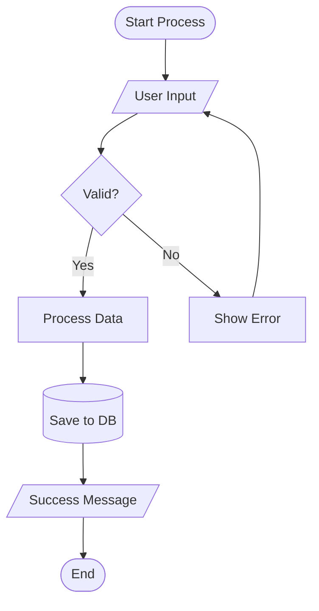
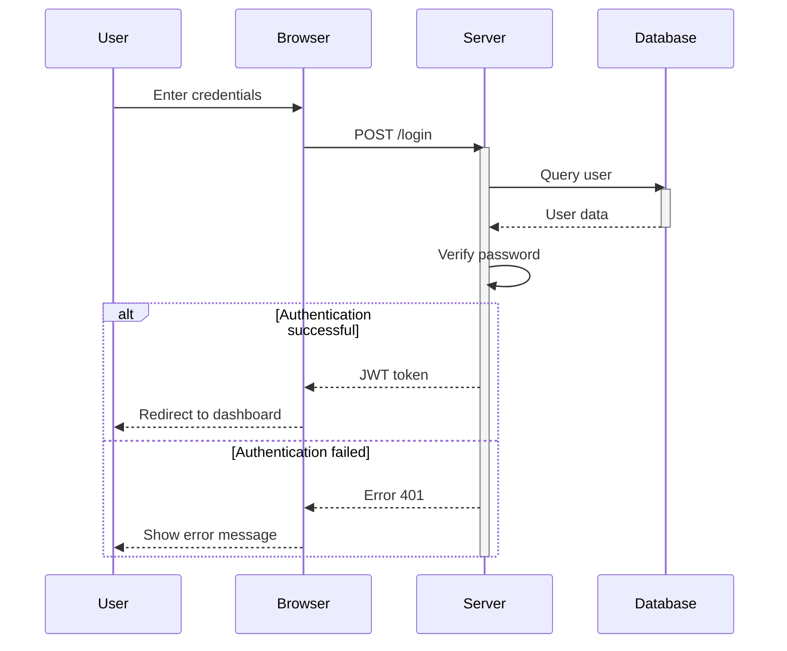
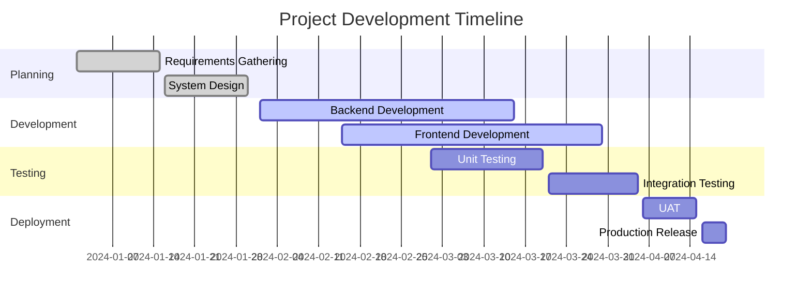
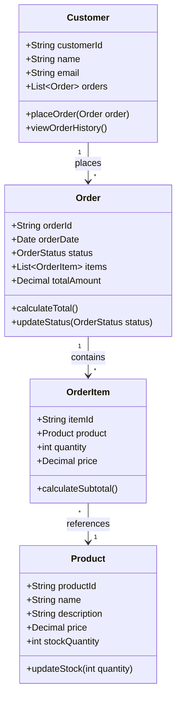
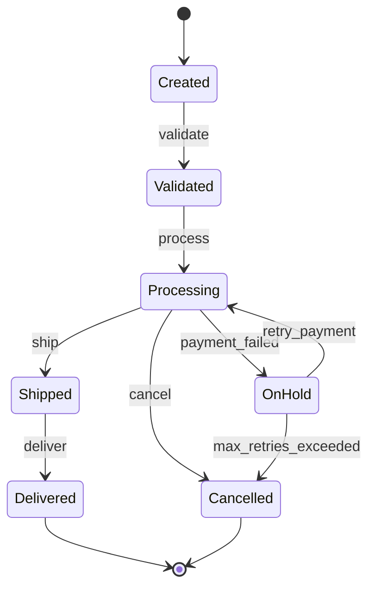
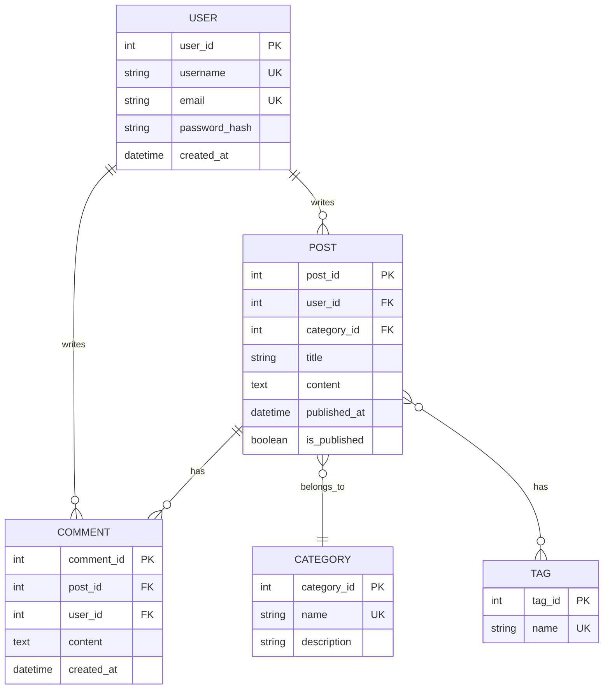
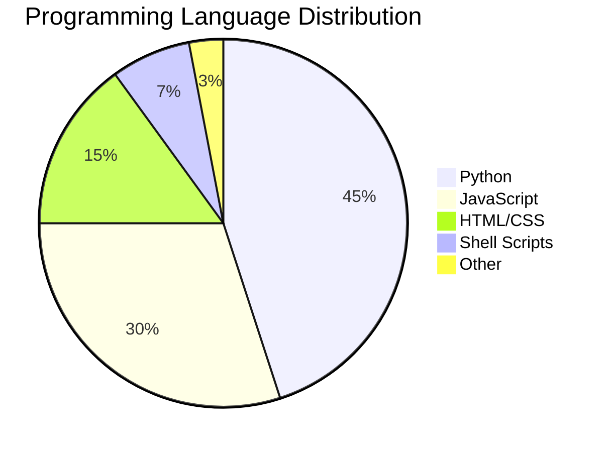
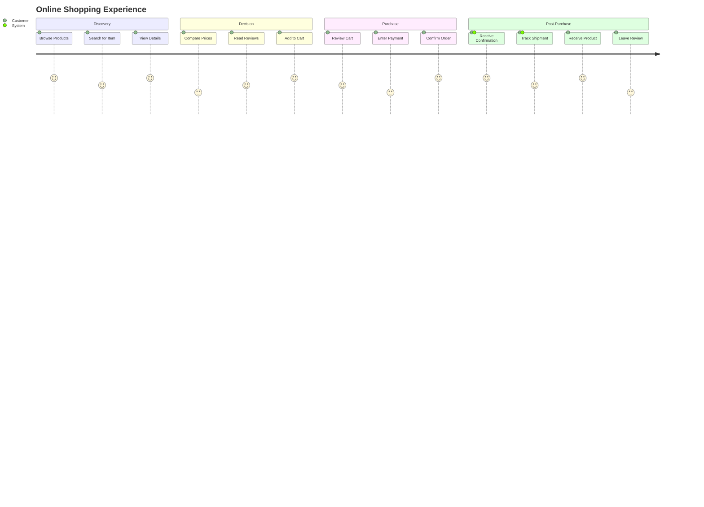
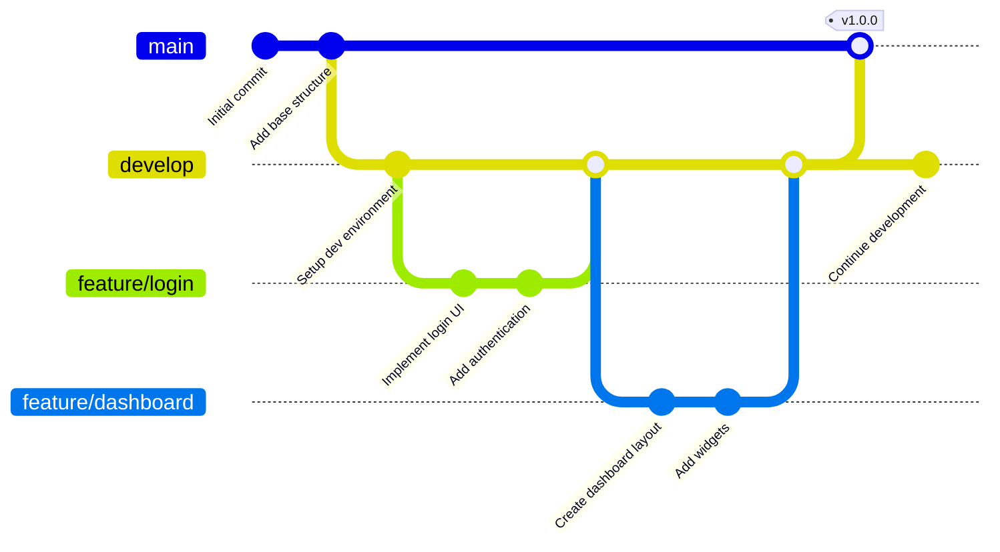

# Sample Markdown Document with Mermaid Diagrams

This document contains various types of Mermaid diagrams for testing purposes.

## Introduction

This is a comprehensive test file that includes multiple diagram types, edge cases, and regular markdown content. It's designed to thoroughly test the MermaidVisualizer extraction and generation capabilities.

## Flowchart Diagram

Here's a simple flowchart showing a decision process:



The flowchart demonstrates various node shapes and decision points.

## Sequence Diagram

This sequence diagram illustrates an authentication flow:



This demonstrates participant interactions and conditional flows.

## Gantt Chart

Project timeline visualization:



Gantt charts are useful for project management and timeline visualization.

## Class Diagram

Here's a class diagram for an e-commerce system:



## State Diagram

State machine for an order processing system:



## Entity Relationship Diagram

Database schema for a blog system:



## Pie Chart

Distribution of programming languages in a project:



## Regular Code Block (Not Mermaid)

This is a regular Python code block that should NOT be extracted as a Mermaid diagram:

```python
def calculate_total(items):
    """Calculate total price of items."""
    total = sum(item.price * item.quantity for item in items)
    return total

# Example usage
items = [Item("Apple", 1.50, 3), Item("Orange", 2.00, 2)]
print(f"Total: ${calculate_total(items):.2f}")
```

## Another Regular Code Block (JavaScript)

```javascript
// Fetch user data from API
async function getUserData(userId) {
    try {
        const response = await fetch(`/api/users/${userId}`);
        const data = await response.json();
        return data;
    } catch (error) {
        console.error('Error fetching user:', error);
        throw error;
    }
}
```

## User Journey Diagram

Customer journey for an online shopping experience:



## Git Graph

Version control branching strategy:



## Edge Case: Empty Mermaid Block

This is an edge case with an empty mermaid block:

```mermaid
```

The above block is empty and should be handled gracefully.

## Edge Case: Mermaid-like Content in Regular Text

Sometimes the word mermaid appears in regular text, like "The mermaid swam in the ocean."
This should not be confused with a mermaid code block.

## Complex Flowchart with Subgraphs

```mermaid
flowchart TB
    subgraph Frontend
        A[Web Browser]
        B[Mobile App]
    end

    subgraph "API Gateway"
        C[Load Balancer]
        D[API Server 1]
        E[API Server 2]
    end

    subgraph Backend
        F[(Database)]
        G[Cache]
        H[Queue]
    end

    A --> C
    B --> C
    C --> D
    C --> E
    D --> F
    D --> G
    E --> F
    E --> G
    D --> H
    E --> H
```

## Conclusion

This document contains **10 valid Mermaid diagrams** of various types:
1. Flowchart (2 instances)
2. Sequence Diagram
3. Gantt Chart
4. Class Diagram
5. State Diagram
6. Entity Relationship Diagram
7. Pie Chart
8. User Journey
9. Git Graph

It also includes:
- Regular markdown text
- Non-Mermaid code blocks (Python, JavaScript)
- Edge cases (empty mermaid block)
- Special characters and Unicode
- Nested structures (subgraphs)

This comprehensive test file ensures that the MermaidVisualizer can handle real-world documentation scenarios.
